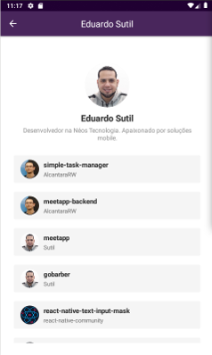
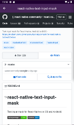

# GitHub View

  


Projeto em react nativee para estudos de conceitos de:

* Layout;
* Debug com reactotron;
* Navegação;
* Configurações de Header da navegação;
* Configurações do eslint e prettier;
* LocalStorage;
* Chamadas http com axios;
* Infinit scroll;
* Pull to Refresh e
* WebView;


dependências importantes:

`.editorconfig`

```javascript
root = true

[*]
end_of_line = lf
indent_style = space
indent_size = 2
charset = utf-8
trim_trailing_whitespace = true
insert_final_newline = true
```

isntalar eslint
```
yarn add eslint -D
```

configurar o eslint
```
yarn eslint --init
```
instalar prettier

```
yarn add prettier eslint-config-prettier eslint-plugin-prettier babel-eslint -D
```

Alterar arquivo `.eslintrc.js`

```javascript
module.exports = {
  env: {
    es6: true,
  },
  extends: [
    'airbnb',
    'prettier',
    'prettier/react'
  ],
  globals: {
    Atomics: 'readonly',
    SharedArrayBuffer: 'readonly',
    __DEV__: 'readonly'
  },
  parser: 'babel-eslint',
  parserOptions: {
    ecmaFeatures: {
      jsx: true,
    },
    ecmaVersion: 2018,
    sourceType: 'module',
  },
  plugins: [
    'react',
    'prettier'
  ],
  rules: {
    'prettier/prettier': 'error',
    'react/jsx-filename-extension': [
      'warn',
      {
        extensions: ['.jsx', '.js']
      }
    ],
    'import/prefer-default-export': 'off',
    'react/state-in-constructor': 'off',
    'react/static-property-placement': 'off'
  },
};

```

criar arquivo `.prettierrc`

```json
{
  "singleQuote": true,
  "trailingComma": "es5"
}

```

